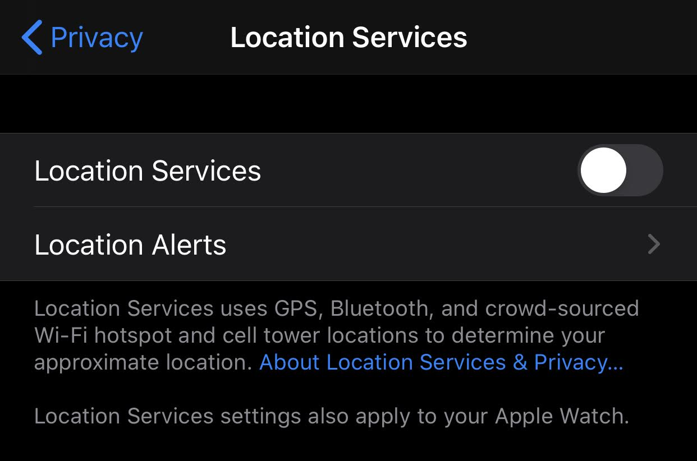

# Protest Info

Your actions before, during, and after a protest have a single goal: 

**YOU WERE NEVER THERE!!!**

With enough time and money, anyone's location history can be traced. Your job is to limit the number of leads to make it too time consuming or expensive for most people and businesses to link you back to a protest.

## Why?

Protests are fine and bonding while you are there, but there are many potential repercussions if things go south even long after the protest has finished. Social media activity is commonly included in legal profiles and [background checks](https://en.wikipedia.org/wiki/Background_check#Social_media) which could make it hard or impossible to get or retain certain jobs or acquire firearms.

## Turn off your phone!!!

Turning your phone completely off is by far the easiest way to reduce your chance of being automatically placed at the site of a protest.

There are [multiple ways](https://en.wikipedia.org/wiki/Mobile_phone_tracking) a cell phone or other electronic devices determine your location, all of which require some form of wireless communication:

- **Cellular** - Cell towers log connected devices. Cell providers sell this info to third-parties for advertizing and location tracking services
- **WiFi** - Cell phones store a list of WiFi names you've connected to as well as ones you've recently seen but not connected to. These are usually unique enough to corroborate other location evidence
- **Bluetooth** - By design, Bluetooth broadcasts unique IDs which can be recorded. Data packets can also be sniffed
- **GPS** - Explicitly designed to determine location. Satellite network doesn't record, but your phone does
- **NFC** - Short range radio can still be recorded by other devices in a crowd. This is currently only an issue with Android phones because Apple doesn't allow NFC access except for Apple Wallet uses

{: style="height:360px;margin-left:auto;margin-right:auto;display:block"}

!!! warning
    Disabling cellular, WiFi, and Bluetooth individually on iOS still leaves GPS turned on.

If you choose not to turn your phone completely off, put it in airplane mode and disable all location services. You can record video and take pictures, but this should disable a location being attached to your photos. And obviously don't share those photos or videos on your social media accounts.

There's an additional benefit to turning off your phone in case you are detained by police: face and thumbprint unlocking is disabled on reboot. Your phone's passcode has historically greater consitutional protections than your face or thumbprint, and the police cannot legally compel you to unlock your phone in this manner without a warrant (which usually come with limits too).

!!! danger "It's dangerous to go alone. Take this!"
    If you choose to keep your phone on and connected, please install a [shortcut like this for iOS](https://www.icloud.com/shortcuts/ab31b23eb7954cc4858e6c1502bfdf7e) that will automatically send your location and a video recording to a chosen contact in case you have issues.

## At the Protest

Remember, your main goal is to have no way of tracing you back to the protest. In addition to turning off your phone, there are two categories you need to watch out for:

### Photo Identification

You will inevitably be in a photo or video posted somewhere on the internet. Your goal is to make it as difficult as possible for someone to recognize you after the fact.

- Wear a face covering
- Wear unmarked clothing. No logos. Preferably all black or white
- Cover up any physically-identifying features like tattoos or hairstyles

Covering clothing is also a good way to hide your emergency contact info drawn on your body. Nothing will out you faster than a clearly visible phone number even if it's not your own.

### Third-Party Tagging

Your want to prevent yourself from being tagged or mentioned in photos or posts by other people who are there or automatically by a company analyzing photos. This requires you to be proactive with your social media accounts which we will discuss below.

## Facebook

This is the biggest target because most people have been on Facebook the longest. It's very easy to get a full snapshot just from Facebook data including:

- Profile info
- Pictures
- Posts
- Comments
- Family (including everything on their profiles)

All links below send you to the Facebook help center, so the instructions should always be accurate.

!!! note
    Some field options like "Only Me" may only be visible by pressing "More" first.

### Your Profile

[Parts of your profile](https://www.facebook.com/help/203805466323736) may always be searchable. It's important to remove or obscure the following information:

- [Change your profile photo](https://www.facebook.com/help/163248423739693) to something unidentifiable
- [Change your cover photo]()
- [Untag yourself from all posts and photos](https://www.facebook.com/help/140906109319589) relevant to the protests
- [Remove these from your profile's About section](https://www.facebook.com/help/353111348061173):
    - Work and Education
    - Places Lived
    - Family and Relationships

### Settings -> Privacy Settings

**Your Activity**

- [Who can see your future posts](https://www.facebook.com/help/120939471321735) - Friends
- [Limit who can see past posts](https://www.facebook.com/help/236898969688346)
- [Who can see the people, Pages, and lists you follow](https://www.facebook.com/help/401227106619293) - Only Me

**How People Find and Contact You**

- [Who can send you friend requests](https://www.facebook.com/help/217125868312360) - Friends of Friends
- [Who can see your friends list](https://www.facebook.com/help/115450405225661?helpref=popular_topics) - Only Me
- [Who can look you up using the email address you provided](https://www.facebook.com/help/mobile-touch/131297846947406?helpref=platform_switcher) - Only Me
- [Who can look you up using the phone number you provided](https://www.facebook.com/help/mobile-touch/131297846947406?helpref=platform_switcher) - Only Me
- [Do you want search engines outside of Facebook to link to your profile](https://www.facebook.com/help/124518907626945) - No

### Settings -> Timeline and Tagging

**Timeline**

- [Who can post on your timeline](https://www.facebook.com/help/115469971891543?helpref=faq_content) - Only Me
- [Who can see what others post on my timeline](https://www.facebook.com/help/246629975377810) - Only Me
- Allow others to share your posts to their stories - Off (no official help doc found)

**Tagging**

- [Who can see posts you're tagged in on your timeline](https://www.facebook.com/help/267508226592992) - Only Me
- [When you're tagged in a post, who do you want to add to the audience of the post if they can't already see it](https://www.facebook.com/help/267508226592992) - Only Me

**Review**

- [Review tags people add to your posts before the tags appear on Facebook](https://www.facebook.com/help/247746261926036) - On
- [Review posts you're tagged in before the post appears on your timeline](https://www.facebook.com/help/168229546579373) - On

### Settings -> Public Posts

- [Who can follow me](https://www.facebook.com/help/273948399619967/) - Friends
- [Public Post Comments](https://www.facebook.com/help/499181503442334) - Friends
- [Public Profile Info](https://www.facebook.com/help/203805466323736) - Friends

### Settings -> Location Settings

- [Location Services](https://www.facebook.com/help/275925085769221) - Off
- [Location History](https://www.facebook.com/help/340945230067368) - Off
- [Delete your location history](https://www.facebook.com/help/340945230067368)

### Other

- Settings -> Active Status -> [Show when you're active](https://www.facebook.com/help/215888465102253) - Off
- Settings -> Face Recognition -> [Disable facial recognition](https://www.facebook.com/help/187272841323203)

## Twitter

## Instagram

